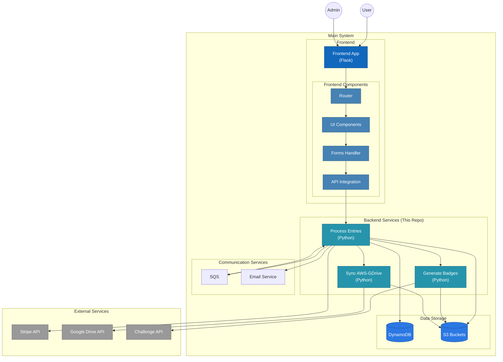

# TKD Registration - Backend

This repo holds the code for the Backend of the "TKD Registration Project".

## Overall Architecture

## Dependencies
- Setup Stripe Account
- Deploy base infrastructure using the [tkd-registration](https://github.com/audioboxer217/terraform-kseppler-tkd-registration) Terraform Module. This must be done **first**.
- Deploy the [Frontend](https://github.com/audioboxer217/tkd-registration-frontend). This can be done before or after.
- Python 3.10
- Optional but recommended: Use a Virtual Env
  - example: 
    > `python -m venv --upgrade-deps .venv`
    >
    > `source .venv/bin/activate`
- Install required packages: `pip install -r requirements.txt`

## Local Development
1. Setup a virutal environment and install 'Dev' Requirements with `pip install -r dev_requirements.txt`
2. Create a 'frontend.env' file with the necessary environment variables
    - AWS_DEFAULT_REGION - Default AWS region
    - AWS_PROFILE - AWS Profile to use from your local .aws/config file
    - BADGE_BUCKET - S3 Bucket name to store the badge files (generated by Terraform)
    - BADGE_GFOLDER - Google Drive Folder to sync badges to (Required only if syncing is used)
    - COMPETITION_NAME - Name to use for the competition
    - COMPETITION_YEAR - Year of the competition
    - CONFIG_BUCKET - S3 Bucket name that contains the config files (generated by Terraform)
    - CONTACT_EMAIL - Email to use as a Contact
    - DB_TABLE - DynamoDB Table generated by Terraform
    - EMAIL_PASSWD - Password for the SMTP server to send emails
    - EMAIL_PORT - Port for the SMTP server to send emails
    - EMAIL_SERVER - Name of the SMTP server to send emails
    - FROM_EMAIL - Email address to use when sending emails
    - PROFILE_PIC_BUCKET - S3 Bucket name for holding profile pics (generated by Terraform)
    - SQS_QUEUE_URL - SQS Queue URL for 'processing' (generated by Terraform)
    - STRIPE_API_KEY - API Key for accessing Stripe (located [here](https://dashboard.stripe.com/apikeys))
3. Run Script Locally
    - If using VSCode, there is a `launch.json` file already in place so you can use the debugger
    - Otherwise, you can run with `python <filename>`

## Deploying
This project uses [Zappa](https://github.com/Zappa/Zappa) for deployments.
1. Ensure there is a yml file in the [envs](./envs/) folder for the environment you want to deploy
    - If there isn't one, you can use an existing yaml file as a template to create a new one.
2. If you are using a Python Virtual Env (recommended), be sure it's activated
    - **Ensure you have the main venv activated and not the 'dev' venv!**
3. Run `zappa deploy <env_name> -s envs/<env_file_name>.yml`

Subsequent updates to the site can be made with `zappa update <env_name> -s envs/<env_file_name>.yml`